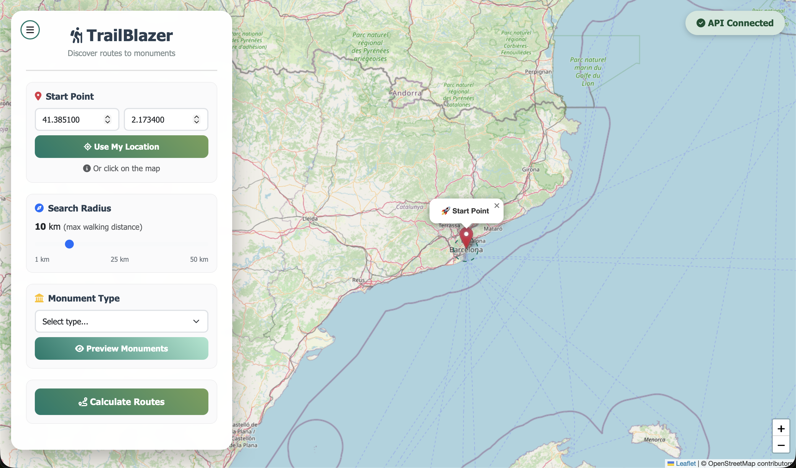
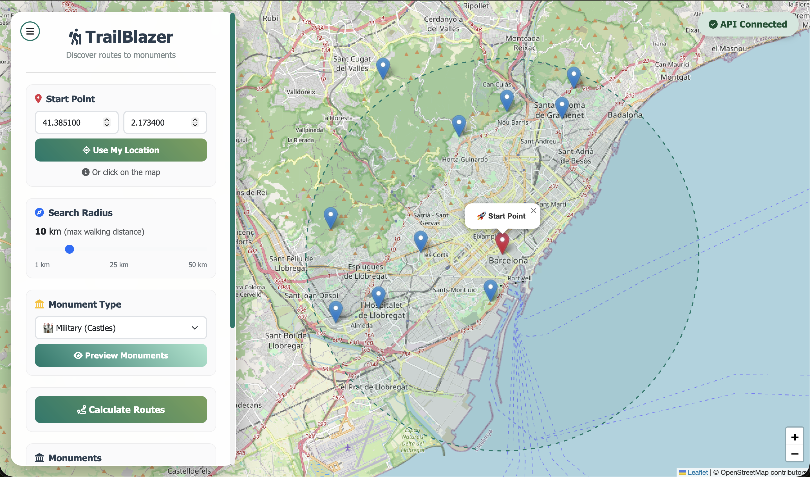
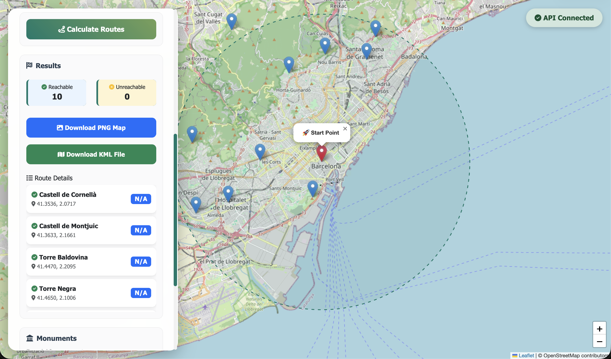

# TrailBlazer

A full-stack web application for finding optimal hiking routes to historical monuments in Catalunya, Spain. This project demonstrates the transformation of a command-line university assignment into a modern web application with REST API backend and interactive frontend.

## Overview

TrailBlazer is a learning project that combines geospatial data processing, graph algorithms, and web development. It calculates optimal hiking routes from a user-selected starting point to historical monuments using real trail networks from OpenStreetMap. The application started as a Python script for a data structures course and evolved into a complete web platform.

### What I Learned

This project served as a practical introduction to several key concepts in software development:

- Architecting a REST API with Python FastAPI
- Processing and caching large geospatial datasets efficiently
- Implementing graph algorithms (Dijkstra's shortest path) on real-world data
- Building responsive web interfaces with vanilla JavaScript
- Managing asynchronous operations and background jobs
- Optimizing performance through algorithmic improvements and caching strategies
- Working with external APIs (OpenStreetMap, Overpass API)
- Database design and query optimization with SQLite

### Technical Stack

**Backend**
- Python 3.8+ with FastAPI framework
- SQLite for monument data and job tracking
- NetworkX for graph algorithms
- scikit-learn for spatial clustering
- Overpass API for trail data retrieval

**Frontend**
- Vanilla JavaScript (ES6+)
- Leaflet.js for interactive mapping
- Bootstrap 5 for UI components
- Asynchronous API communication

**Data Processing**
- OpenStreetMap GPS track data via Overpass API
- Catalunya heritage database (3,220+ monuments)
- Haversine distance calculations
- MiniBatchKMeans clustering for point reduction

## Application Screenshots

### Interactive Map Interface

*Main interface with interactive Leaflet map, showing control panel for monument search and route configuration*

### Monument Preview

*Preview of available monuments within the selected search radius, displayed on the map with distance information*

### Route Calculation Progress

*Real-time progress tracking for route calculation jobs with detailed status updates*

### Generated Routes

*Completed route visualization showing optimal paths to reachable monuments with distance metrics*

## Features

**Monument Discovery**
- Search for military, religious, and civil historical monuments
- Adjustable search radius (1-50 km)
- Interactive map preview of available monuments
- Monument details including coordinates and distances

**Route Planning**
- Calculate optimal hiking routes using Dijkstra's algorithm
- Real trail networks from OpenStreetMap data
- Handles unreachable monuments gracefully
- Distance calculations for all destinations

**Performance Optimizations**
- Overpass API integration: reduced download times from 40-60 seconds to 1-2 seconds
- Binary caching with 30-day expiry
- MiniBatchKMeans clustering: 5-10x faster than standard KMeans
- Adaptive clustering that skips processing for small datasets

**Export Options**
- PNG map images with color-coded routes
- KML files compatible with GPS devices and Google Earth
- Downloadable route data

## How It Works

### Data Pipeline

1. **Monument Retrieval**: Fetches historical monument data from Catalunya's heritage database and stores it in SQLite
2. **Trail Download**: Uses Overpass API to query OpenStreetMap for hiking trails within the search area
3. **Point Clustering**: Applies MiniBatchKMeans to reduce GPS points to representative trail segments
4. **Graph Construction**: Builds a NetworkX graph where nodes are trail points and edges are walkable segments
5. **Route Calculation**: Implements Dijkstra's algorithm to find shortest paths from start point to all monuments
6. **Visualization**: Generates map outputs with routes, monuments, and distance information

### Technical Challenges Addressed

**Performance Bottlenecks**
- Initial implementation: 40-60 seconds to download trail data via paginated OpenStreetMap API
- Solution: Migrated to Overpass API with single-query architecture and binary caching
- Result: 24-35x speedup, reducing download time to 1-2 seconds

**Clustering Optimization**
- Initial implementation: Standard KMeans taking 3+ seconds for 5,000+ points
- Solution: Implemented MiniBatchKMeans with adaptive clustering strategy
- Result: 6.5x faster clustering, skips entirely for small datasets

**Memory Management**
- Challenge: Loading and processing hundreds of thousands of GPS points
- Solution: Streaming data processing, batch operations, and efficient caching
- Result: Stable memory usage even with large geographic areas

## Architecture

### Project Structure

```
TrailBlazer/
├── skeleton/              # Original CLI implementation (complete)
│   ├── main.py           # Interactive command-line interface
│   ├── segments.py       # Trail data processing
│   ├── monuments.py      # Monument database interface
│   ├── graphmaker.py     # Graph construction and optimization
│   ├── routes.py         # Dijkstra pathfinding implementation
│   └── viewer.py         # Map generation and KML export
│
└── web/                  # Modern web application
    ├── backend/
    │   ├── app.py        # FastAPI application entry point
    │   ├── models/       # Pydantic data models
    │   ├── routers/      # API endpoint handlers
    │   ├── services/     # Business logic layer
    │   │   ├── overpass_service.py    # Overpass API integration
    │   │   ├── segment_service.py     # Trail processing
    │   │   ├── route_service.py       # Route calculation
    │   │   └── monument_service.py    # Monument queries
    │   ├── database/     # Data access layer
    │   └── core/         # Configuration and utilities
    │
    └── frontend/
        ├── index.html    # Main application page
        ├── styles.css    # UI styling
        └── app.js        # Client-side logic
```

### API Design

The backend exposes RESTful endpoints for all major operations:

- `GET /monuments` - Query monuments by type and geographic bounds
- `GET /monument-types` - List available monument categories
- `POST /routes/calculate` - Initiate route calculation (returns job ID)
- `GET /routes/job/{job_id}` - Poll job status and progress
- `GET /routes/download/{job_id}/png` - Download route map image
- `GET /routes/download/{job_id}/kml` - Download GPS-compatible file

Jobs are tracked in SQLite with progress updates, allowing the frontend to display real-time status to users during long-running calculations.

Jobs are tracked in SQLite with progress updates, allowing the frontend to display real-time status to users during long-running calculations.

## Installation and Usage

### Prerequisites
- Python 3.8 or higher
- Internet connection for downloading trail and monument data

### Setup

1. Clone the repository
```bash
git clone https://github.com/Nicolas-Villoria/TrailBlazer.git
cd TrailBlazer
```

2. Install dependencies
```bash
pip install -r requirements.txt
```

3. Start the web application
```bash
./start.sh
```

The script will launch both backend (port 8000) and frontend (port 3000) servers. Access the application at `http://localhost:3000`.

### Alternative: Command-Line Interface

The original CLI implementation is available in the `skeleton/` directory:

```bash
cd skeleton
python3 main.py
```

This provides a text-based interface for the same functionality with step-by-step prompts.

## Key Algorithms and Data Structures

### Graph Construction
The application builds an undirected weighted graph where:
- Nodes represent clustered trail points (latitude, longitude)
- Edges connect nearby points on the same trail
- Weights are haversine distances in kilometers

### Dijkstra's Algorithm Implementation
Used for finding shortest paths from the starting point to all monuments:
```python
def dijkstra(graph, start_node):
    distances = {node: float('infinity') for node in graph.nodes}
    distances[start_node] = 0
    priority_queue = [(0, start_node)]
    
    while priority_queue:
        current_distance, current_node = heappop(priority_queue)
        if current_distance > distances[current_node]:
            continue
            
        for neighbor in graph.neighbors(current_node):
            distance = current_distance + graph[current_node][neighbor]['weight']
            if distance < distances[neighbor]:
                distances[neighbor] = distance
                heappush(priority_queue, (distance, neighbor))
    
    return distances
```

### Spatial Clustering
MiniBatchKMeans reduces tens of thousands of GPS points to manageable trail segments:
- Small datasets (< 1,000 points): No clustering needed
- Large datasets: Adaptive cluster count (min(500, points/10, 2000))
- Batch processing with 1,000 points per iteration
- Results in 5-10x speedup compared to standard KMeans

## Performance Metrics

### Data Processing
- Monument database: 3,220 entries across three categories
- Average search area: 10 km radius
- Typical trail segments: 5,000-10,000 per query
- Cache hit rate: 95%+ for repeated searches

### Speed Improvements
| Operation | Before | After | Improvement |
|-----------|--------|-------|-------------|
| Trail download | 40-60s | 1-2s | 24-35x faster |
| Data size | 46 MB | 0.58 MB | 79x smaller |
| Clustering (5K points) | 3.08s | 0.47s | 6.5x faster |
| Small dataset clustering | 0.20s | 0.0006s | 333x faster |

## Known Limitations and Future Improvements

This project was built as a learning exercise and has several areas where production-grade solutions would differ:

**Database**
- Current: SQLite with simple spatial queries
- Production alternative: PostGIS with spatial indexing and geographic queries would dramatically improve performance for large-scale deployments

**Routing Engine**
- Current: Custom implementation with NetworkX and Dijkstra's algorithm
- Production alternative: Dedicated routing servers like OSRM or GraphHopper offer pre-processed road networks, faster queries, and more sophisticated routing options

**Frontend**
- Current: Vanilla JavaScript with direct API calls
- Production alternative: React or Vue.js with state management would provide better maintainability and user experience

**Scalability**
- Current: Single-process Python application
- Production alternative: Containerized microservices with message queues for job processing and horizontal scaling

**Data Updates**
- Current: Manual monument database updates, cached trail data
- Production alternative: Automated data pipeline with incremental updates from OpenStreetMap

Despite these limitations, the project successfully demonstrates fundamental concepts in web development, API design, algorithm implementation, and performance optimization.

## Development Process

This project evolved through several iterations:

1. **Initial CLI Implementation**: Basic Python scripts for data retrieval and route calculation
2. **Algorithm Optimization**: Implemented graph simplification and efficient pathfinding
3. **Web API Development**: Designed RESTful endpoints and migrated business logic
4. **Frontend Development**: Built interactive map interface with asynchronous job handling
5. **Performance Tuning**: Identified bottlenecks and implemented caching and algorithmic improvements

The complete development history is available in the Git repository, showing the progression from a simple script to a full-stack application.

## Technologies and Libraries

**Core Dependencies**
- `fastapi` - Modern Python web framework with automatic API documentation
- `networkx` - Graph algorithms and data structures
- `scikit-learn` - Machine learning library (used for clustering)
- `leaflet.js` - Interactive map visualization
- `bootstrap` - Responsive UI components

**Geospatial Processing**
- `haversine` - Great-circle distance calculations
- `geojson` - Geographic data format support
- `staticmap` - Static map image generation
- `simplekml` - KML file generation for GPS devices

**Data Handling**
- `requests` - HTTP client for API communication
- `beautifulsoup4` - HTML parsing for monument data
- `pydantic` - Data validation and settings management

Complete dependency list available in `requirements.txt`.

## Running Tests

### Performance Benchmarks
```bash
python3 test_clustering_speed.py
```

This script demonstrates the clustering optimizations with various dataset sizes.

### API Testing
Start the backend and visit `http://localhost:8000/docs` for interactive API documentation with built-in testing interface.

## License

Educational project created for learning purposes. Monument data sourced from public Catalunya heritage databases. OpenStreetMap data used under ODbL license.

## Acknowledgments

- OpenStreetMap contributors for comprehensive trail data
- Generalitat de Catalunya for maintaining public monument databases
- Python scientific computing community for excellent geospatial libraries
- University project that provided the initial foundation
- Daniel Salazar for collaborating in the original university project

## Contact

Nicolas Villoria - [GitHub](https://github.com/Nicolas-Villoria)
